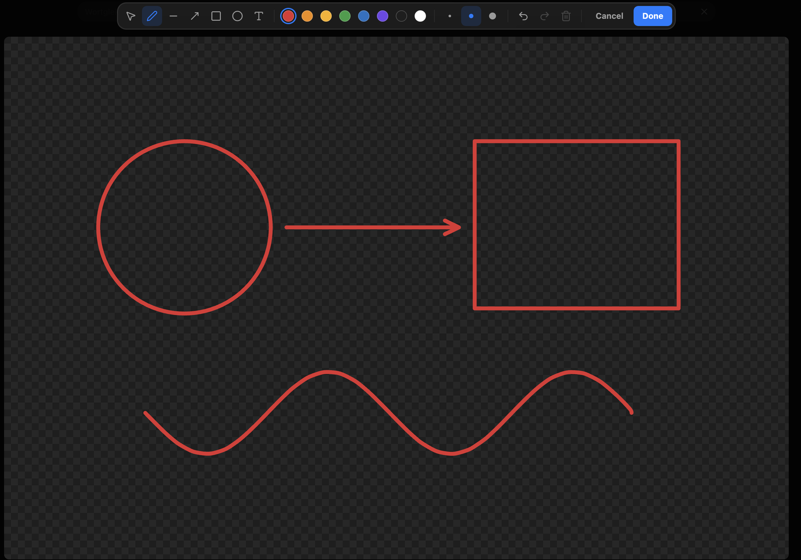

# Scribe for Obsidian

Draw on your images without leaving your notes — and draw where there is no image at all.



Scribe puts a pen next to Obsidian's own image buttons. Click it and the image opens for drawing: freehand strokes, lines, arrows, rectangles, ellipses and text. Everything stays editable — come back a week later and move the arrow you drew.

## Features

**A pen wherever an image is.** In the image action bar next to *Zoom in*, on images in reading view, and in Obsidian's image viewer.

**Surfaces — drawing without a picture.** `Cmd/Ctrl + Ctrl + M` drops an empty, transparent sheet at the cursor and opens it for drawing. It behaves like any other image in your note, and it carries no background, so your theme shows through.

**A shape that settles.** While a surface is empty, its corner grip sets width and height freely — make it wide, make it tall. The first stroke settles the shape: from then on the grip scales it without distorting what you drew.

**Drawings that stay editable.** Strokes, shapes and text are kept inside the image file, so you can reopen and change them. The picture you started from is kept untouched in the same file; remove every element and save, and it comes back.

**Drawing that behaves itself.**

- Freehand strokes are smoothed without rounding off sharp corners.
- Lines snap to 45° steps, boxes snap to squares, and edges and centres snap to other objects with guides.
- Hold <kbd>Shift</kbd> to force a snap, <kbd>Cmd/Ctrl</kbd> to ignore all of them.
- Click a text with the text tool to edit it. With any other tool, a click picks up what you hit instead of drawing over it.

**Excalidraw annotations can move over.** A command converts images annotated with the Excalidraw plugin into Scribe drawings.

## How your drawings are stored

A drawing is written into the image itself, as two private PNG chunks: `skDt` holds the editable elements, `skOr` holds the original picture. The result is an ordinary PNG — it shows the drawing everywhere: in Obsidian, in Finder, on the web, in an export. Nothing is stored beside your vault, and nothing breaks if the plugin is gone.

Images that are not PNG become PNG on the first save, and Obsidian updates the links for you.

## Installing

Scribe is not in the community plugin list yet.

**With BRAT** (updates itself): add `apfelFunker/obsidian-scribe` in *BRAT → Add beta plugin*.

**By hand:**

1. Download `main.js`, `manifest.json` and `styles.css` from the [latest release](https://github.com/apfelFunker/obsidian-scribe/releases/latest).
2. Put them in `<your vault>/.obsidian/plugins/scribe/`.
3. Turn on **Scribe** in *Settings → Community plugins*.

## Using it

| | |
| --- | --- |
| Draw on an image | Click the pen: in the image's action bar, in reading view, or in the image viewer |
| New empty surface | `Cmd/Ctrl + Ctrl + M`, or the command *Insert drawing surface* |
| Resize a surface | Drag its corner — free while empty, proportional once drawn on |
| Tools | <kbd>V</kbd> select · <kbd>P</kbd> pen · <kbd>L</kbd> line · <kbd>A</kbd> arrow · <kbd>R</kbd> rectangle · <kbd>O</kbd> ellipse · <kbd>T</kbd> text |
| Undo / redo | `Cmd/Ctrl + Z` · `Cmd/Ctrl + Shift + Z` |
| Delete selection | <kbd>Backspace</kbd> |
| Leave | `Esc` keeps what you drew · *Cancel* throws it away |

The hotkey is free to change in *Settings → Hotkeys*.

## Good to know

- **Desktop only** for now: drawing uses the image viewer and the file handling of the desktop app.
- **Obsidian 1.13 or newer**, because the pen sits in Obsidian's own image action bar.
- **Your files stay yours.** Scribe writes only to the image you draw on, and only when you press *Done*.

## Building it yourself

```bash
npm install
npm test          # unit tests
npx tsc --noEmit  # type check
node esbuild.config.mjs production
```

Then copy `main.js`, `manifest.json` and `styles.css` into `<vault>/.obsidian/plugins/scribe/`.

## Contributing

Bug reports and ideas are welcome in the [issues](https://github.com/apfelFunker/obsidian-scribe/issues). If you send a pull request, please keep the tests green — every behaviour in `src/` that can be tested without Obsidian has a test in `tests/unit/`.

## Licence

MIT — see [LICENSE](LICENSE).
