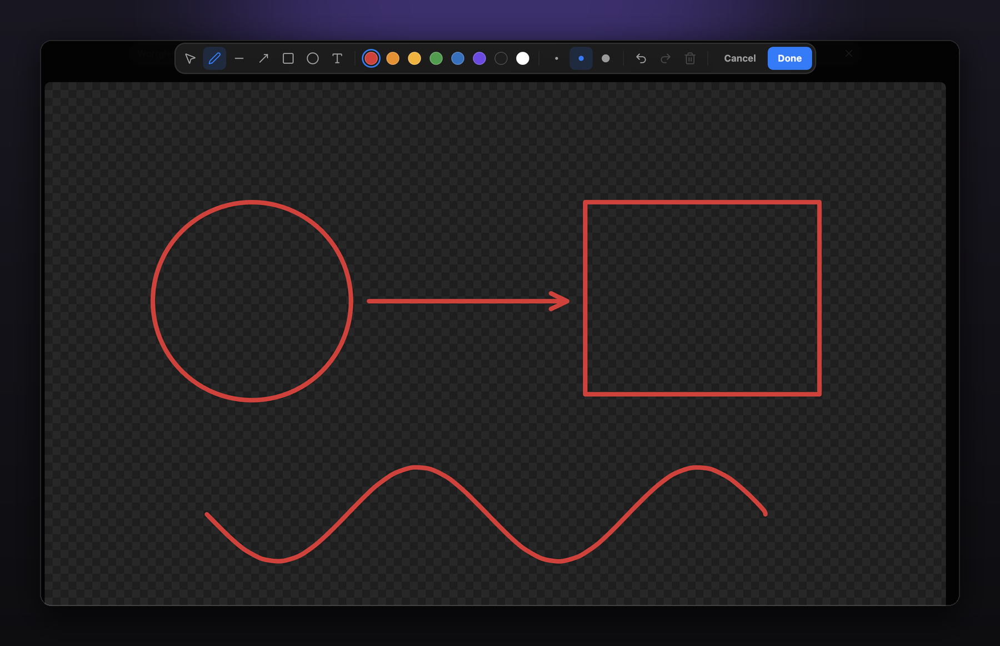

<h1>
  
  &nbsp;Scribe
</h1>

Scribe lets you draw on the images in your notes, and on empty sheets where there is no image at all. It puts a pen next to Obsidian's own image buttons: click it, and the picture opens for freehand strokes, lines, arrows, boxes, ellipses and text.

Everything you draw stays editable. Come back a week later and move the arrow, recolour the circle, or take it all off again — the picture you started from is still underneath.



## Get started

### Requirements

Scribe runs on **Obsidian 1.13 or newer**, on the **desktop app**. It sits in Obsidian's own image action bar and writes to image files, which the mobile apps do not allow in the same way.

### Install

Scribe is not in the community plugin list yet.

With [BRAT](https://github.com/TfTHacker/obsidian42-brat), which keeps it up to date: add `apfelFunker/obsidian-scribe` under *BRAT → Add beta plugin*.

By hand:

1. Download `main.js`, `manifest.json` and `styles.css` from the [latest release](https://github.com/apfelFunker/obsidian-scribe/releases/latest).
2. Put them in `<your vault>/.obsidian/plugins/scribe/`.
3. Turn on **Scribe** in *Settings → Community plugins*.

### Draw on your first image

Hover an image in a note and click the pen in the buttons that appear. Draw, then press **Done**. The drawing is saved into the image file, and the note shows it straight away.

### Draw where there is no image

Press `Cmd/Ctrl + Ctrl + M`. An empty, transparent 16:9 sheet lands at your cursor. Drag its corner into the shape you want — while the sheet is empty, width and height move freely — then open it with the pen and draw.

## What you can do

**Reach the pen from anywhere an image is shown.** In the image action bar next to *Zoom in*, on images in reading view, and in Obsidian's image viewer.

**Keep a sheet's shape once it matters.** An empty sheet takes any shape you drag it into. The first stroke settles it: from then on Obsidian's own corner scales the sheet without distorting what you drew.

**Draw without fighting the tool.** Freehand strokes are smoothed, but sharp corners stay sharp. Lines snap to 45° steps, boxes snap to squares, and edges and centres snap to other objects with guides. Hold <kbd>Shift</kbd> to force a snap, <kbd>Cmd/Ctrl</kbd> to ignore every one of them.

**Pick things up instead of drawing over them.** With any tool, a click takes hold of what you hit; only a drag draws. Click a text with the text tool and you are editing it again.

**Bring Excalidraw annotations along.** A command converts images annotated with the Excalidraw plugin into Scribe drawings.

| | |
| --- | --- |
| Draw on an image | The pen: in the image's action bar, in reading view, or in the image viewer |
| New empty sheet | `Cmd/Ctrl + Ctrl + M`, or the command *Insert drawing surface* |
| Resize a sheet | Drag its corner — free while empty, proportional once drawn on |
| Tools | <kbd>V</kbd> select · <kbd>P</kbd> pen · <kbd>L</kbd> line · <kbd>A</kbd> arrow · <kbd>R</kbd> rectangle · <kbd>O</kbd> ellipse · <kbd>T</kbd> text |
| Undo / redo | `Cmd/Ctrl + Z` · `Cmd/Ctrl + Shift + Z` |
| Delete selection | <kbd>Backspace</kbd> |
| Leave | `Esc` keeps what you drew · *Cancel* throws it away |

The hotkey is free to change in *Settings → Hotkeys*.

## Where your drawings live

A drawing is written into the image itself, in two private PNG chunks: `skDt` holds the editable elements, `skOr` holds the original picture. What comes out is an ordinary PNG — it shows the drawing everywhere: in Obsidian, in Finder, on the web, in an export. Nothing is stored beside your vault, and nothing breaks if the plugin is gone. Remove every element and save, and the original picture is back.

Images that are not PNG become PNG on the first save, and Obsidian updates the links for you.

Scribe writes only to the image you draw on, and only when you press *Done*.

## Building it yourself

```bash
npm install
npm test          # unit tests
npx tsc --noEmit  # type check
node esbuild.config.mjs production
```

Then copy `main.js`, `manifest.json` and `styles.css` into `<vault>/.obsidian/plugins/scribe/`.

## Contributing

Bug reports and ideas are welcome in the [issues](https://github.com/apfelFunker/obsidian-scribe/issues). If you send a pull request, please keep the tests green: every behaviour in `src/` that can be tested without Obsidian has a test in `tests/unit/`.

## Licence

MIT — see [LICENSE](LICENSE).

Scribe is a community plugin. It is not made or endorsed by the Obsidian team, and the app icon in the mark above is theirs.
